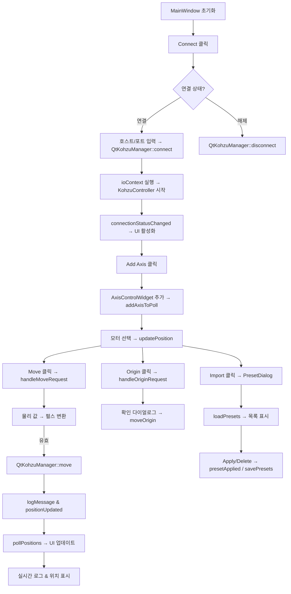
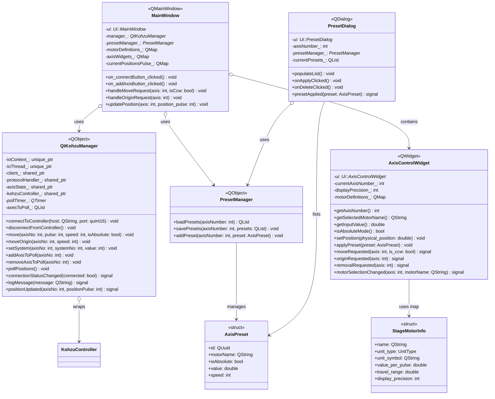

# Qt Kohzu Controller

## 개요
`qtkohzucontroller`는 Kohzu 모션 컨트롤러를 제어하는 Qt 기반 GUI 애플리케이션입니다. `kohzu-controller` 라이브러리를 래핑하여 사용자 친화적인 인터페이스를 제공하며, 연결 관리, 축 제어, 프리셋 저장/로드, 실시간 로그를 지원합니다. 물리 단위(mm/°)로 입력을 처리하고, 펄스로 변환하여 하드웨어와 통신합니다.

---

## 주요 기능
- **컨트롤러 연결**: IP/포트를 통한 연결 및 연결 해제.
- **축 관리**: 축 추가/제거, 모터 선택(예: mm/° 단위).
- **이동 제어**: 절대/상대 이동, 원점 복귀, 속도 설정.
- **프리셋 관리**: JSON 기반 프리셋 저장, 로드, 삭제.
- **실시간 업데이트**: 축 위치를 물리 단위로 표시.
- **로그**: 명령 결과와 오류를 실시간 로그로 표시.
- **UI**: 다크 테마, 유효성 검사(범위, 원점 복귀 확인).

### 워크플로우


---

## 의존성
- **Qt6** (Core, Widgets): GUI 구성.
- **Boost** (Asio): 비동기 통신.
- **spdlog**: 로깅.
- **kohzu-controller**: 저수준 컨트롤러 라이브러리.

---

## 빌드 방법 (window 기준 (수정 필요))
1. VCPKG 툴체인 설정:
   ```bash
   export VCPKG_ROOT=/path/to/vcpkg
   ```
2. 의존성 설치:
   ```bash
   vcpkg install qt6 boost-asio spdlog
   ```
3. CMake 빌드 디렉토리 생성:
   ```bash
   cmake -B build -S . -DCMAKE_TOOLCHAIN_FILE=$VCPKG_ROOT/scripts/buildsystems/vcpkg.cmake
   ```
4. 프로젝트 빌드:
   ```bash
   cmake --build build
   ```
5. 애플리케이션 실행:
   ```bash
   ./build/src/app/QtKohzuController
   ```
   qt creator를 사용해 빌드 함. (의존성 패키지 설치 후 Boost에서 오류가 난다면 kohzu-controller/CMakeLists.txt의 Boost::asio를 ${Boost_LIBRARIES}로 변경

---

## 사용 방법
1. **연결**: 호스트 IP(예: 192.168.1.120)와 포트(예: 12321)를 입력 후 "Connect" 클릭.
2. **축 추가**: 축 번호(1~32)를 선택하고 "Add Axis" 클릭.
3. **모터 선택**: 드롭다운에서 모터(예: RA04A-W, ZA05A-W1)를 선택.
4. **이동**: 절대/상대 모드 선택, 값/속도 입력 후 ▶/◀ 버튼으로 이동.
5. **원점 복귀**: "Origin" 버튼 클릭(확인 필요).
6. **프리셋**: "Import"로 저장된 프리셋 로드/적용/삭제.
7. **로그**: 하단 로그 창에서 명령 결과 확인.

---

## 프로젝트 구조
```
qtkohzucontroller/
├── CMakeLists.txt
└── src/
    ├── app/
    │   ├── main.cpp
    │   ├── axiscontrollwidget/AxisControlWidget.{h,cpp,ui}
    │   ├── mainwindow/mainwindow.{h,cpp,ui}
    │   ├── presetdialog/PresetDialog.{h,cpp,ui}
    │   └── resources/app.qrc, styles/stylesheet.qss
    └── lib/
        ├── kohzu-controller/
        └── qt-kohzu-manager/
            ├── CMakeLists.txt
            ├── PresetManager.{h,cpp}
            ├── QtKohzuManager.{h,cpp}
            └── StageMotorInfo.h
```

---

## 클래스 명세
아래는 주요 클래스의 세부 명세입니다. 각 클래스의 목적, 주요 메서드, 속성, 신호/슬롯을 설명합니다.

### StageMotorInfo (구조체)
- **목적**: 모터 사양 정의(이름, 단위, 펄스당 값 등). getMotorDefinitions()로 QMap 제공.
- **주요 속성**:
  - `QString name`: 모터 이름.
  - `UnitType unit_type`: Linear 또는 Angular.
  - `QString unit_symbol`: "mm" 또는 "°".
  - `double value_per_pulse`: 펄스당 이동 값.
  - `double travel_range`: 최대 이동 범위.
  - `int display_precision`: 표시 소수점 자릿수.
- **메서드**: 없음 (구조체).

### PresetManager (클래스, QObject 상속)
- **목적**: 축별 프리셋(AxisPreset: id, motorName, isAbsolute 등) JSON 저장/로드.
- **주요 메서드**:
  - `QList<AxisPreset> loadPresets(int axisNumber)`: 파일 로드.
  - `void savePresets(int axisNumber, const QList<AxisPreset>& presets)`: 파일 저장.
  - `void addPreset(int axisNumber, const AxisPreset& preset)`: 프리셋 추가 및 저장.
- **속성**: 없음 (내부적으로 디렉토리 경로 관리).

### QtKohzuManager (클래스, QObject 상속)
- **목적**: kohzu-controller 래퍼. Qt 신호로 UI 업데이트.
- **주요 슬롯**:
  - `void connectToController(const QString& host, quint16 port)`: 연결 및 모니터링 시작.
  - `void disconnectFromController()`: 연결 해제 및 정리.
  - `void move(int axisNo, int pulse, int speed, bool isAbsolute)`: 이동 명령.
  - `void moveOrigin(int axisNo, int speed)`: 원점 복귀.
  - `void setSystem(int axisNo, int systemNo, int value)`: 시스템 설정.
- **신호**:
  - `void connectionStatusChanged(bool connected)`.
  - `void logMessage(const QString& message)`.
  - `void positionUpdated(int axisNo, int positionPulse)`.
- **속성**: `std::unique_ptr<boost::asio::io_context> ioContext_`, `std::shared_ptr<KohzuController> kohzuController_`, `QTimer* pollTimer_`.

### AxisControlWidget (클래스, QWidget 상속)
- **목적**: 축별 UI 위젯. 모터 선택, 입력, 버튼 처리.
- **주요 메서드**:
  - `int getAxisNumber() const`, `QString getSelectedMotorName() const` 등 getter.
  - `void setPosition(double physical_position)`: 위치 표시 업데이트.
  - `void applyPreset(const AxisPreset& preset)`: 프리셋 적용.
- **신호**:
  - `void moveRequested(int axis, bool is_ccw)`.
  - `void originRequested(int axis)`.
  - `void removalRequested(int axis)`.
  - `void motorSelectionChanged(int axis, const QString& motorName)`.
- **속성**: `Ui::AxisControlWidget *ui`, `QMap<QString, StageMotorInfo> motorDefinitions_`.

### PresetDialog (클래스, QDialog 상속)
- **목적**: 프리셋 목록 다이얼로그. 적용/삭제 버튼.
- **주요 메서드**:
  - `void populateList()`: 리스트 채우기.
  - 슬롯: `onApplyClicked()`, `onDeleteClicked()`.
- **신호**: `void presetApplied(const AxisPreset& preset)`.
- **속성**: `Ui::PresetDialog *ui`, `QList<AxisPreset> currentPresets_`.

### MainWindow (클래스, QMainWindow 상속)
- **목적**: 메인 UI. 연결, 축 관리, 위치 업데이트.
- **주요 슬롯**:
  - `void on_connectButton_clicked()`: 연결 토글.
  - `void on_addAxisButton_clicked()`: 축 추가.
  - `void handleMoveRequest(int axis, bool isCcw)`: 이동 처리(펄스 변환, 범위 검사).
  - `void updatePosition(int axis, int positionPulse)`: 물리 단위 변환 및 표시.
- **속성**: `Ui::MainWindow *ui`, `QtKohzuManager *manager_`, `PresetManager *presetManager_`, `QMap<int, AxisControlWidget*> axisWidgets_`.

---

## 주요 코드 설명
아래는 핵심 코드 부분의 설명입니다. 코드 스니펫과 함께 동작 원리를 세부적으로 설명합니다.

### 펄스 변환 및 이동 (MainWindow::handleMoveRequest)
```cpp
void MainWindow::handleMoveRequest(int axis, bool isCcw) {
    AxisControlWidget* widget = axisWidgets_.value(axis, nullptr);
    if (!widget) return;
    savePreset(axis);
    QString motorName = widget->getSelectedMotorName();
    const StageMotorInfo& motor = motorDefinitions_[motorName];
    double valuePhysical = widget->getInputValue();
    if (isCcw) valuePhysical = -qAbs(valuePhysical); else valuePhysical = qAbs(valuePhysical);
    bool isAbsolute = widget->isAbsoluteMode();
    int speed = widget->getSelectedSpeed();
    double targetPosPhysical = isAbsolute ? valuePhysical : currentPosPhysical + valuePhysical;
    // 범위 검사
    if (targetPosPhysical < 0 || targetPosPhysical > motor.travel_range * 2) {
        QMessageBox::critical(...);
        return;
    }
    int movePulse = std::round(targetPosPhysical / motor.value_per_pulse);
    manager_->move(axis, movePulse, speed, isAbsolute);
}
```
- **설명**: 물리 값을 펄스로 변환. 범위 검증 후 manager_ 호출. isCcw로 방향 처리.

### 프리셋 저장 (PresetManager::addPreset)
```cpp
void PresetManager::addPreset(int axisNumber, const AxisPreset &newPreset) {
    QList<AxisPreset> presets = loadPresets(axisNumber);
    presets.prepend(newPreset); // 리스트 상단에 추가
    savePresets(axisNumber, presets);
}
```
- **설명**: 기존 프리셋 로드 후 새 항목 추가, JSON으로 저장. QUuid로 ID 생성.

### 위치 폴링 (QtKohzuManager::pollPositions)
```cpp
void QtKohzuManager::pollPositions() {
    if (axisState_) {
        for (int axisNo : std::as_const(axesToPoll_)) {
            int pos = axisState_->getPosition(axisNo);
            emit positionUpdated(axisNo, pos);
        }
    }
}
```
- **설명**: QTimer로 100ms마다 axisState_ 조회. 신호로 UI 업데이트.

---

## 아키텍처

- **QtKohzuManager**: `kohzu-controller`를 래핑, Qt 신호/슬롯으로 UI와 통신.
- **MainWindow**: 연결, 축 추가, 위치 업데이트 관리.
- **AxisControlWidget**: 축별 UI, 모터 선택 및 입력 처리.
- **PresetDialog**: 프리셋 목록 표시 및 관리.
- **PresetManager**: JSON 파일로 프리셋 저장/로드.
- **모터 정의**: `StageMotorInfo`로 물리 단위와 펄스 변환 관리.
- **폴링**: QTimer로 100ms마다 위치 업데이트.
- **스타일링**: 다크 테마 stylesheet.qss 적용.

---

## 확장 가능성
- 다축 동기화 이동 지원.
- 동적 모터 구성 로드(파일 기반).
- 추가 UI 기능(예: 그래프 시각화).

---

## 라이선스
